# Ultimate Frisbee App (UFA)
**This is the main README of the Ultimate Frisbee App project repository.**

The README is divided into 3 parts:

1. About the app
2. Technical documentation
3. The contributions (global)

*This README has been put together by the three contributors for this repository. Each of us had our share contributing to this README and we worked like a team to set up the main functionalities. If you want to read an in-depth README about the individual contributions that have been made for this repository, please follow the links below.*

- [Go to the individual README of contributor Fons Hettema](https://github.com/strexx/Ultimate-Frisbee-App/blob/master/README_fons.md)
- [Go to the individual README of contributor Melvin Reijnoudt](https://github.com/melvinr/Ultimate-Frisbee-App)
- [Go to the individual README of contributor Senny Kalidien](https://github.com/sennykalidien/EW/tree/master/projects/meesterproef)

**Live demo**

[https://www.meesterproef.directzichtbaar.nl](http://www.meesterproef.directzichtbaar.nl)

----

## Table of content
1. [The app](#the-app)
  1. [About the app](#about-the-app)
  2. [The problem](#the-problem)
  3. [Design problem](#design-problem)
  4. [Target audience](#target-audience)
  5. [Use cases](#use-cases)
  6. [Design challenges](#design-challenges)
  7. [The solution](#design-solution)
  8. [First version](#first-version)
  9. [Testing](#testing)
  10. [Interations](#iterations)
  11. [Final results](#final-results)
  12. [Live demo](#live-demo)
2. [Technical documentation](#technical-documentation)
  1. [Main functionalities](#main-functionalities)
  2. [The structure](#the-structure)
  3. [Features and Packages](#features-and-packages)
  4. [How to install](#how-to-install)
  5. [How to develop](#how-to-develop)
3. [The contributions](#the-contributions)
  1. [The workflow](#the-workflow)
  2. [The contributors](#the-contributors)
  3. [The individual contributions](#the-individual-contributions)

----

## The app
### About the app
The Ultimate Frisbee App started as a school assignment for the Amsterdam University of Applied Sciences, at the study of  Communication and Multimedia Design. Christian Schaffner, a frisbee fanatic and the client for this assignment, had the wish to have a mobile app that can keep scores for the Ultimate Frisbee tournaments.

### The problem
For the public viewers of an Ultimate Frisbee tournament it's difficult to keep tab on when and where a team is playing and what the scores are. There isn't a good resource available to be updated continuously with the latest scores.

For the teams that are playing multiple games a day, it's important to know when and where they are playing.

For the organization of the tournaments there needs to be a fast and secure  solution to confirm and store the (final) scores in the Leaguevine system, which is used to create leagues, tournaments, teams, games and calculation of the ranking, rounds and points.

### Design problem
*How can a mobile web application allow the organization of the Ultimate Frisbee tournaments to receive the (final) scores of a finished match instantly and at the same time serve the public viewers and the teams with real-time (score) updates and other info about the matches during a tournament.*

### Assignment
Build a real-time, progressive enhanced and responsive web application, in which Ultimate Frisbee fans can check and update scores.

### Target audience
- **The public** that wants to be updated with the latest scores.
- **The teams** that want to be updated with the latest scores and know where and when they are playing.
- **The scorekeepers** who are present at the game and need to keep score and insert those scores into the system.
- **The client** who wants to have the scores stored on a digital platform and updated within the Leaguevine API.

### Use cases
What are the most important cases of the users for this app?

#### Must haves
1. As a user I want to have real-time score updates about a match or multiple matches (that I'm interested in).
2. As a user I want to have an overview of the matches that are being played during the tournament and on which field.
3. As a user I want to update the scores of my (favorite) team(s).
4. As a user I want to follow my favorite teams.
5. As a user I want to be able to visit the app, even if I have a bad internet connection.
6. As a scorekeeper of a game I want to confirm the final score, so the score can be updated in the system (Leaguevine API).
7. As a scorekeeper I want to see the matches that are relevant to me.

#### Could haves
1. As a user I want to be notified if a (favorite) team scores.
2. As a user I want to view the scores on a public screen.
3. As a scorekeeper I want to have a personal overview of all the teams that I need to keep the scores for during the tournament.
4. As a team I want to fill in my sprit scores.
5. As a client I want to receive the spirit scores into the Leaguevine API.

### Design challenges
During this project there were the following design challenges:
- The user can experience *bad* to *no* mobile internet connection at some locations of the Ultimate Frisbee tournaments.
- The user isn't always aware of where the matches are being played.
- The Leaguevine API, which is very slow, can be overloaded if there are many requests to the server.

### Design solution
A mobile-first, responsive, real-time, **progressive web application** made in **Node.js**, with the use of **socket.io** and **MongoDB**. *To make the web app a minimum viable product, the app will only display the games of the WindMill tournaments, an event that's being held every year.*

- Node.js is used to keep the application lightweight, fast, and highly customizable. It also allows us to make the application progressive enhanced, so   it's viewable for all kinds of users. Some examples of cases would be to have no JavaScript enabled, slow to no internet connection or using a screenreader. It also allows us to make the app real-time, by using a websocket library that can communicate between the client and the server with only the use of JavaScript.

- Socket.io is the websocket JavaScript library used to make the app update the scores real-time to all the users without the need of constantly refreshing the page.

- MongoDB is used to create a database to reduce the API calls to the highly vulnerable and slow serving Leaguevine API. The app will do a daily API request to store the matches from the Windmill tournaments and divisions of the current day in the database. Each time a score is updated, the database will be updated. If a scorekeeper confirms the final score of a match, an API post request will be done to the API to update and synchronize the API with the database.

- Progressive web app is used to make the application work offline, this is done with a Service Worker. If the user has a bad internet connection, he will still be able to visit the webapp and see the most recent scores.

### First version
#### Mobile view - Matches + Match detail
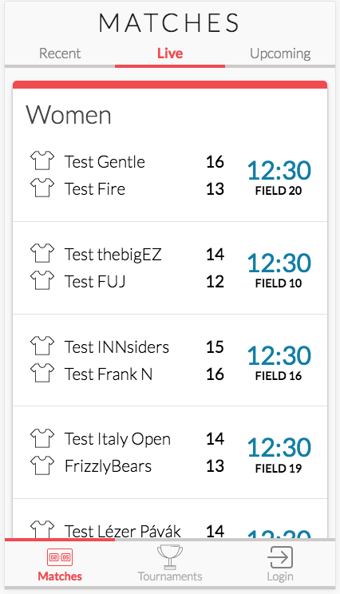
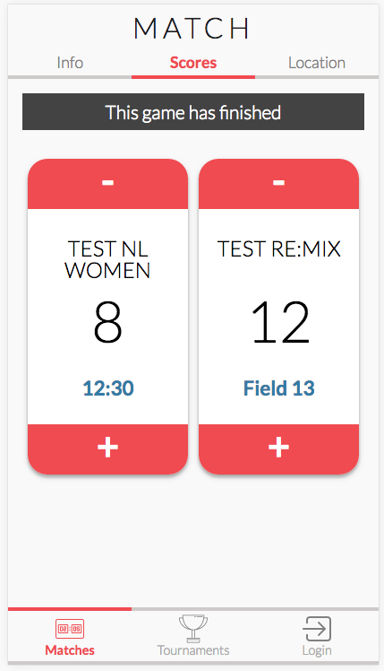

#### Desktop view - Matches
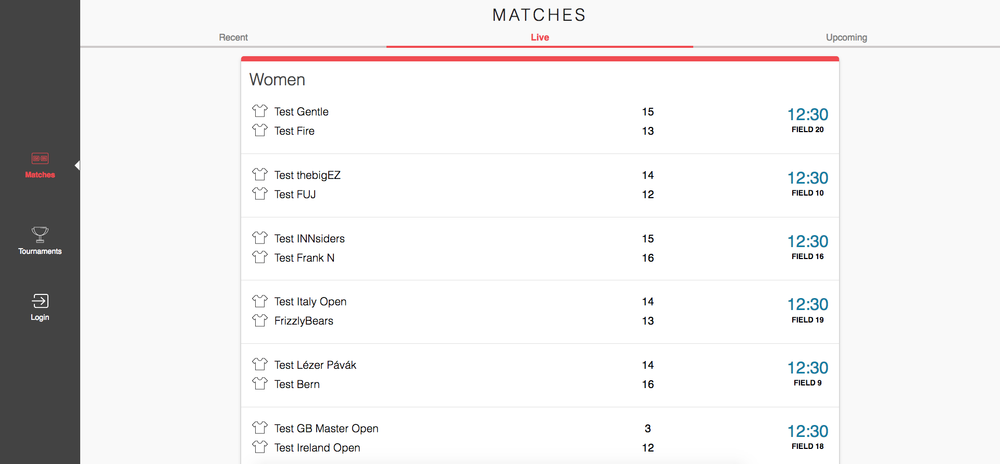

#### Mobile view - Tournaments overview + Tournament detail
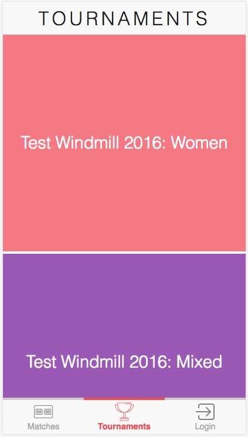
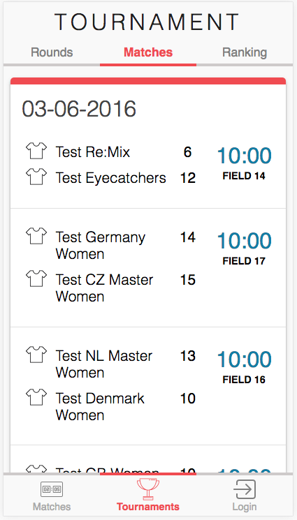

#### Desktop view - Tournaments
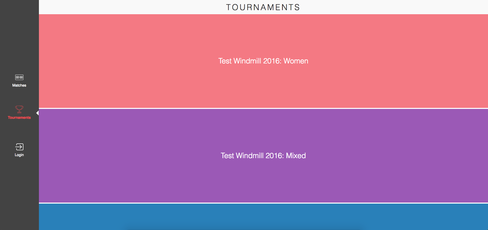

### Testing

The application was tested on a multitude of devices and browsers on our own machines and in the device lab at the school building of our university. The tested browsers include an old version of Chrome for Android 2.3 and the foreign UC Browser.

The application was also tested with 5 test subjects. Below you can find all the found issues and iterations.

#### Browser and device compatibility

#### Tablet
1. The buttons would still show the standard IOS buttons, instead of the buttons we custom created in CSS.
2. The tabs would not always work.
3. The Tournaments overview page showing all the available tournaments would scroll laggy.

### Iterations:
These are the iterations that've been made after continuously testing with our test subjects and receiving feedback from our teachers.

####Added login for scorekeepers
Because the Leaguevine API requires a match to be labeled as final, it is important that there are users that have this responsibility. To ensure that not everyone can do this, since you can't edit scores afterwards, we added a login functionality for scorekeepers. When they are logged in, they get to see a checkbox and a button that gives them the ability and responsibility to label a match as final.

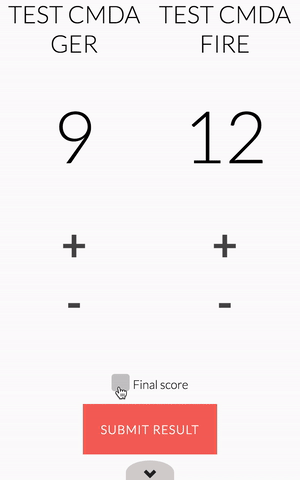


#### Added feedback when changing score
When a user changes a score, there is always a possibility of something going wrong. The user can press the wrong button, or press the button too often. By providing the user with time to change the score or cancel the changes before it actually updates, you minimize the chances of false scores being displayed. To tackle this, we created a loading bar which indicates how far along the update is. If the bar is full, the score will be updated. This gives the user time to change the score before it is actually shown, or cancel the update in its entirety.


#### Added favorites
To make the application more personal and quick in use, we added the favorites feature. The user can add matches to favorites by tapping of clicking the star. The star will animate and turn yellow, indicating that the match has been added to favorites. The matches that are added to favorites are stored in a cookie and also shown on a new page, the favorites page. Here the user sees the matches they added to favorites, so they can get a much quicker overview of the matches they want to keep track of.

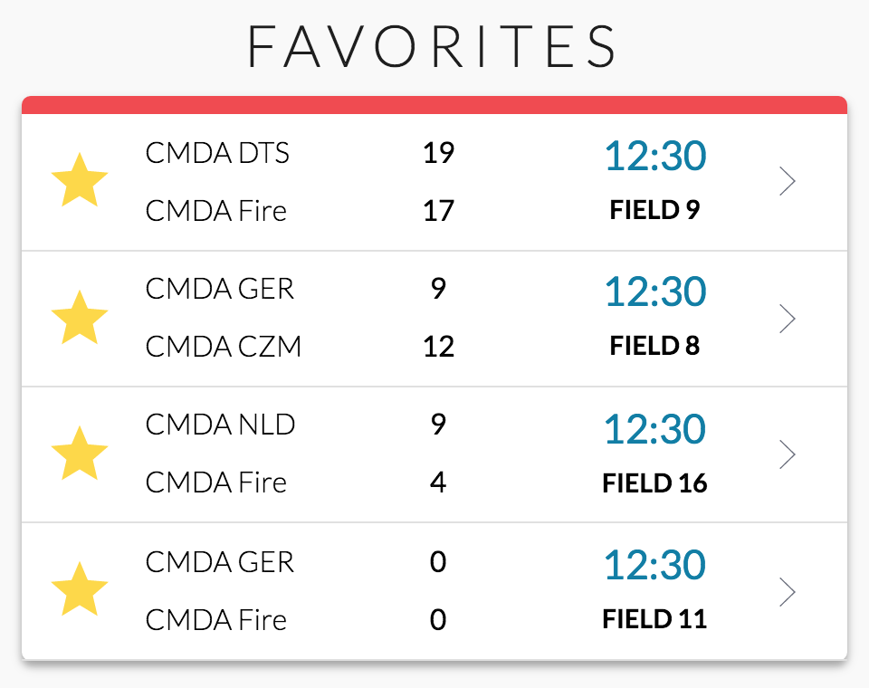

#### Update scores on matches page
Before, the user had to click on a match which sent them to a detail page where he or she could update the score. This meant that they had to leave the matches (overview) page in order to update scores. To prevent this, we decided to provide the user with a way of updating scores on the matches page. We did this by creating a dropdown. When a user clicks on a match, a dropdown containing buttons appears. Here the user can update the scores without having to leave the page. If they want to, they can still go to the detail page. This detail page now has a new main functionality and purpose, it serves as a way for tournaments (and users) to focus on one game and show a live scoreboard.

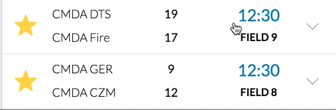


#### Detail page design
The detail page had some design issues, something we struggled with for a long time. After brainstorming about this a lot, we decided to keep its design as clean and minimalistic as possible. Taking away all visual distractions. The buttons are now placed beneath each other, and there is more focus on the scores.

Before there were three tabs, we reduced this to two because the information showed on the "location" and the "info" tab could easily be merged together. This way the user has all the information he or she needs in one view, instead of two.

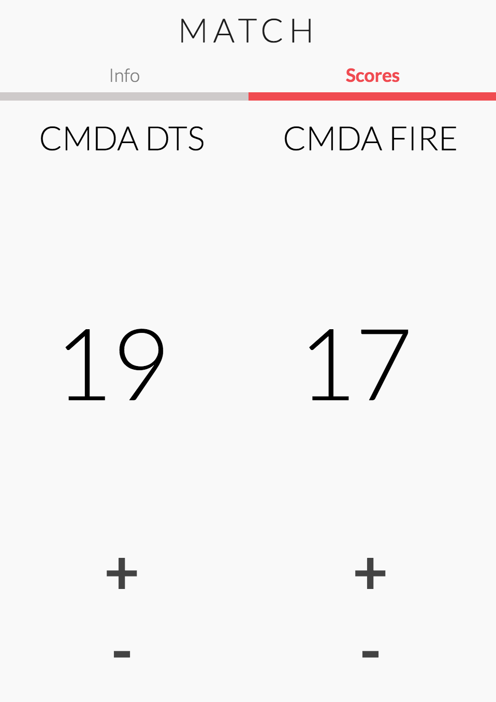

#### Hide menu
When the user opens a page, the menu is shown at first. After a short delay the user will see the menu slide down, out of sight. There is still a button with an arrow which gives the user visual feedback and the ability to bring the menu back up. By doing this we were able to free space which allows the user to focus more on the main content instead of on the menu. The menu is still available within one tap, and by watching it slide down the user gets a better idea of where the menu went and what's beneath the arrow.

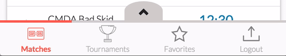

#### Desktop view
Before we received feedback on the UI, the application barely had a desktop view. It was basically the same view as on mobile, which meant that the user had to scroll down a lot. This isn't very user friendly so we decided to change this. We decided to place the division blocks next to each other, also adding a horizontal scrollbar (like Trello). This way the user has a much better overview of matches that are being played. The design is inspired by Google's material design.

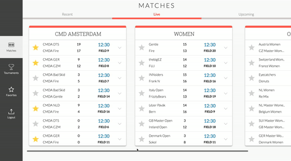

#### Animations
To make the application feel more alive, we added a couple of small functional animations. Take for example the favorite button. When favoriting a match, the star will animate and change color. This is a fun and useful way of showing the user that they tapped the button and an action has been executed.


## Final Results
#### Mobile view - Matches + Match detail


#### Desktop view - Matches + match detail

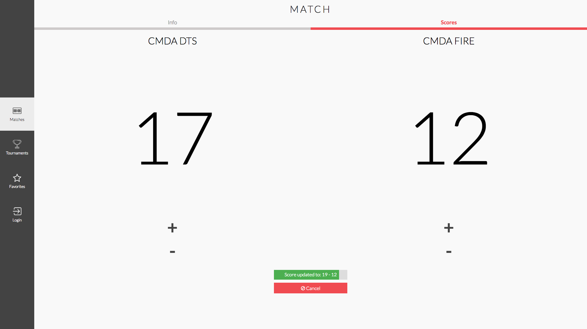

#### Mobile view - Tournaments overview + Tournament detail
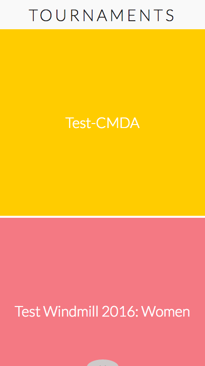
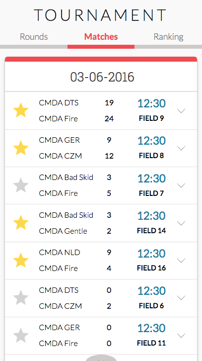

#### Desktop view - Tournaments
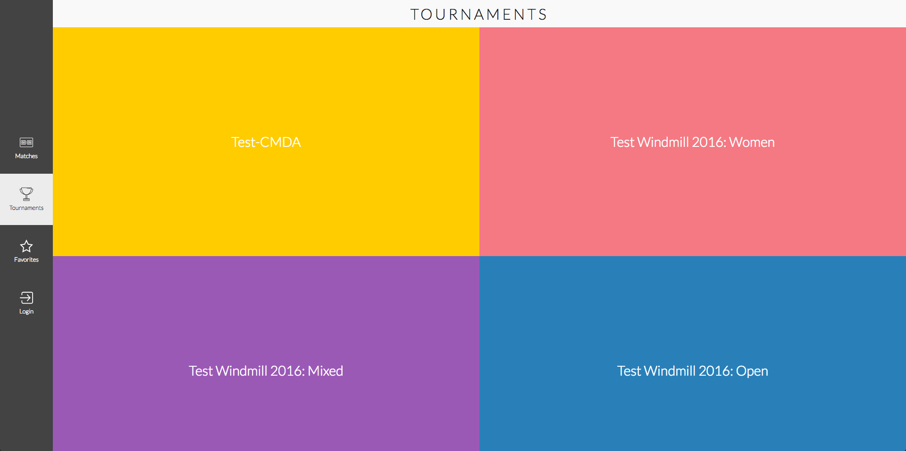

#### Mobile view - Favorites + Login

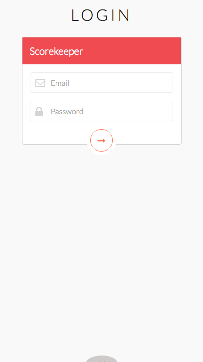

----

## Technical documentation

### Main functionalities
- Node.js
- MongoDB
- Socket.io
- Gulp

### The structure
```
├── connections                                 // Folder with database and socket.io connections setup
|    ├── database.js                            // Database connection setup
|    ├── socket.js                              // Web Sockets connection setup
├── lib                                         // Library folder
|    ├── mongodb.js                             // General database calls
|    ├── socket-io.js                           // Socket listeners with functionality
├── modules                                     // General modules setup
|    ├── formatDigits.js                        // Time formatting
|    ├── multiRequest.js                        // Multiple HTTP-requests handler
|    ├── uniqueKeys.js                          // Get unique values from an array
├── node_modules                                // Node modules
├── public                                      // Client side folder
|    ├── src                                    // Source folder
|    |    |── css                               // Styling for the application
|    |    |   ├── reset.css                     // Styling reset
|    |    |   ├── styles.css                    // Styling main file
|    |    ├── images                            // All images used in the application
|    |    ├── js                                // All client-side JavaScript logic
|    |    |   ├── appLauncher.js                // Main js file for launching app flow
|    |    |   ├── fontFaceObserver.js           // Font Face Observer functionality
|    |    |   ├── pages.js                      // Pages functionality
|    |    |   ├── router.js                     // Router functionality
|    |    |   ├── scores.js                     // Scores functionality
|    |    |   ├── serverWorker.js               // Service Worker functionality
|    |    |   ├── tools.js                      // Tools functionality
|    |    |   ├── ux.js                         // Ux behaviour functionality
|    |    ├── lib                               // Library folder
|    |    |   ├── fontfaceobserver.min.js       // Font Face Observer library
|    |    |   ├── modernizr.js                  // Modernizr library
|    |    |   ├── socket.io.min.js              // Socket.io library
|    ├── index.html                             // Basic HTML file for critical css
|    ├── sw.js                                  // Main Service Worker file
├── routes                                      // Routes folder
|    ├── api.js                                 // Servers api file with requests and database storage
|    ├── index.js                               // Page routing, rendering and data logic
├── scripts                                     // Scripts folder
|    ├── deploy                                 // Jenkins deploy bash script for server deployment
├── sessions                                    // All sessions stored when user logging in
├── views                                       // All views of the application, rendered with handlebars.
|    ├── partials                               // Partials
|    |    |── content                           // Partials content
|    |    |   ├── content_matches.hbs
|    |    |   ├── content_ranking.hbs
|    |    ├── footer                            // Partials footer
|    |    |   ├── footer_login.hbs
|    |    |   ├── footer_matches.hbs
|    |    |   ├── footer_tournaments.hbs
|    |    ├── header                            // Partials header
|    |    |   ├── header_login.hbs
|    |    |   ├── header_match.hbs
|    |    |   ├── header_matches.hbs
|    |    |   ├── header_tournament.hbs
|    |    |   ├── header_tournaments.hbs
|    |    ├── loader.hbs
|    |    ├── scripts.hbs
|    |    ├── splash.hbs
├── .gitignore                                  // Git ignore file
├── app.js                                      // Application bootstrap
├── gulpfile.js                                 // Gulp task managing configuration file
├── package.js                                  // Node.js installation file with dependencies
├── readme.md                                   // This readme file
```

### Features and packages

#### NPM packages
Overview of NPM packages / dependencies used to run the application.

Name                 | Version | Description
:------------------- | :------ | :----------
body-parser          | 1.15.0  | Body parsing middleware for node.js
dateformat        	 | 1.0.12  | Date formatting for node.js
express              | 4.13.4  | Fast, unopinionated, minimalist web framework
express-session      | 1.13.0  | Session middleware for Express
gsap 				 	 | 4.0.0   | Animation library
hbs      			 	 | 2.2.3   | Express.js template engine plugin for Handlebars
jsonfile             | 1.1.2   | Easily read/write JSON files.
mongodb              | 2.1.21  | The official MongoDB driver for node.js
password-hash        | 1.2.2   | Password hashing and verification for node.js
path          		 | 0.12.7  | Provides utilities for working with file and directory paths
request              | 2.72.0  | Simplified HTTP request client.
session-file-store   | 0.2.0   | Session file store is a provision for storing session data in the session
socket.io            | 1.4.6   | Node.js realtime framework server

### Feature list

#### Per school course
1. CSS to the rescue
2. Web App From Scratch
3. Performance Matters
4. Real Time Web
5. Browser Technologies
6. EXTRA: Server Side

#### Overview
| Feature                           | Course        |
| --------------------------------- | ------------- |
| Score functionality               | 2, 4, 5, 6    |
| Progressive Enhancement           | 5             |
| Tabs                              | 1, 2, 6       |
| MongoDB database                  | 2, 6          |
| User accounts (scorekeepers)      | 6             |
| CSS Animations and Transitions    | 1, 3, 5       |
| Real Time using socket.io         | 2, 4          |
| Service Worker                    | 2, 3, 5       |
| API                               | 2, 6          |
| Font Face Observer                | 3             |
| Critical CSS                      | 3             |
| LoadCSS                           | 3             |
| First meaningful render           | 3             |
| Login                             | 5, 6          |
| Feedback login (error page)       | 1, 2, 6       |
| Logout                            | 6             |
| User sessions                     | 6             |
| Tournament page                   | 1, 2, 6       |
| Menu design pattern               | 1             |
| Responsive                        | 1             |
| Gulp                              | 3             |
| Partials                          | 2             |
| Handlebars                        | 2, 4          |
| Feature detection                 | 2, 5          |
| Progressive Web App               | 6             |
| Multirequest                      | 2, 6          |
| Modules                           | 2, 3          |
| Jenkins                           | 3, 6          |
| FlexBox                           | 1, 5          |
| Modernizr                         | 1, 5          |
| BEM                               | 1, 3          |
| Checkbox                          | 1             |

#### Future feature wishlist
- User type related content
- Cachebuster with gulp
- Add team color
- Comments and likes on matches
- Touch events
- Overview of games per field
- Current ranking on live results tab


### How to install
A small tutorial on how to install the Node application on your own local machine.

**Git repository**:
[https://github.com/strexx/Ultimate-Frisbee-App.git](https://github.com/strexx/Ultimate-Frisbee-App.git)

#### 1 - Clone the repository
```
git clone https://github.com/strexx/Ultimate-Frisbee-App.git
```

#### 2 - Navigate to the cloned repository

```
cd <path/to/file>
```

#### 3 - Install the node modules and packages
```
npm install
```

#### 4 - Start Gulp to create a dist folder with concatenated and minified files

```
gulp
```

#### 5 - Start the application
```
npm start
```

#### 6 - View the app in the browser
The app will be listening to port 3010. Open the browser and go to either ``http://127.0.0.1:3010`` or ``http://localhost:3010``


### How to develop
- Changes to the server side files can be modified in the folders of the root.
- Changes to the client side CSS and JS can be made in the public folder.
- HTML can be changed in the views folder

#### 1 - Use gulp watch to let Gulp watch for any changes
```
gulp watch
```

#### 2 - Use nodemon to automatically refresh the page on any changes

```
nodemon app.js
```

Open your browser and go to ``http://localhost:3010``

----

## The contributions
"A lot of the application's functionality and structure was created as a result of a collaborative effort. The three of us communicated through appear.in and tackled most of the major functionalities as a team. We feel that our workflow and personal growth has had a lot of benefits from this way of working. Our personal development and motivation to work got a boost and in the end helped us to create an even better application."

### The workflow

#### Used PM tools (communication and planning)
- [Trello](http://www.trello.com)
- [Google Drive](http://www.drive.google.com)
- [Telegram](http://www.telegram.com)
- [Appear](http://www.appear.in)
- [Slack](http://www.slack.com)
- [Harvest](http://www.harvest.com)

#### Overview of tasks done each week (in dutch)


## The Contributors
- [Fons Hettema](https://github.com/strexx)
- [Melvin Reijnoudt](https://github.com/melvinr)
- [Senny Kalidien](https://github.com/sennykalidien)

### The individual contributions
- [Read the individual readme of Fons Hettema](https://github.com/strexx/Ultimate-Frisbee-App)
- [Read the individual readme of Melvin Reijnoudt](https://github.com/melvinr/Ultimate-Frisbee-App)
- [Read the individual readme of Senny Kalidien](https://github.com/sennykalidien/EW/tree/master/projects/meesterproef#tasks-per-week)
