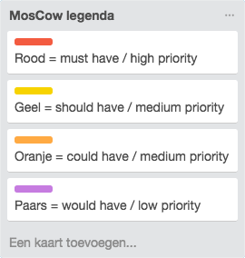
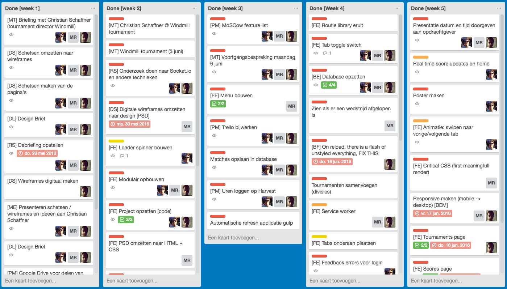
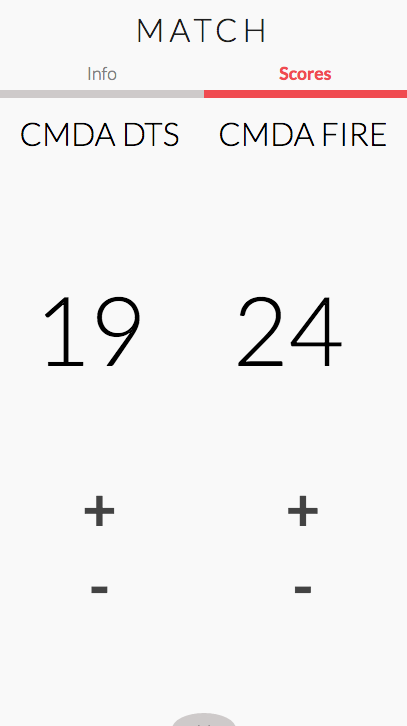
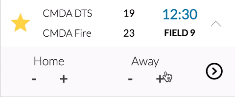
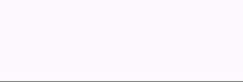
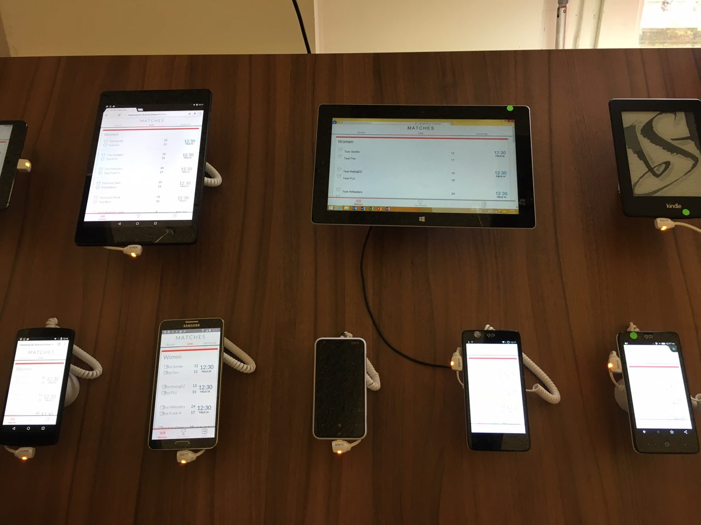

# Individual readme

**Important:** this is the **individual README** of Fons Hettema for the Ultimate Frisbee Project. In this document you'll see what I have contributed to this project for each course during the minor Everything Web on a weekly basis. These courses are all related to (modern) web development standards. If you want to read an in-depth README about the other individual contributions by Melvin Reijnoudt and Senny Kalidien, please follow the links below:

- [Go to the individual README of contributor Melvin Reijnoudt](https://github.com/melvinr/Ultimate-Frisbee-App)
- [Go to the individual README of contributor Senny Kalidien](https://github.com/sennykalidien/Ultimate-Frisbee-App)

------

# Table of contents

1. [Ultimate Frisbee App](#1-ultimate-frisbee-app)
2. [Tasks per week](#2-tasks-per-week)
3. [Used techniques from courses in minor](#3-used-techniques-from-courses-in-minor)
4. [Teamwork makes a dream work](#4-teamwork-makes-a-dream-work)
5. [Install this app](#5-install-this-app)
6. [General readme](#6-general-readme)


# 1. Ultimate Frisbee App

**Live demo**

[https://www.meesterproef.directzichtbaar.nl](http://www.meesterproef.directzichtbaar.nl)

### About the app
The Ultimate Frisbee App started as a school assignment for the Amsterdam University of Applied Sciences, at the study of Communication and Multimedia Design. This app is a web app, built in the popular platform Node.js. It's currently designed to show the latest matches for the Windmill Tournaments, which is a yearly event. The app uses the Leaguevine API for getting the scores and updating the score.

When using the app it will allow you to post scores to the app in real-time, which other users are able to see live without ever refreshing the page. That is just one of the many strenghts of this web app...

### The problem
For the public viewers of an Ultimate Frisbee tournament it's difficult to keep tab on when and where a team is playing and what the scores are. There isn't a good resource available to be updated continuously with the latest scores.

For the teams that are playing multiple games a day, it's important to know when and where they are playing.

For the organization of the tournaments there needs to be a fast and secure  solution to confirm and store the (final) scores in the Leaguevine system, which is used to create leagues, tournaments, teams, games and calculation of the ranking, rounds and points.

### Design problem
*How can a mobile web application allow the organization of the Ultimate Frisbee tournaments to receive the (final) scores of a finished match instantly and at the same time serve the public viewers and the teams with real-time (score) updates and other info about the matches during a tournament.*

### Assignment
Build a real-time, progressive enhanced and responsive web application, in which Ultimate Frisbee fans can check and update scores.

### Target audience
- **The public** that wants to be updated with the latest scores.
- **The teams** that want to be updated with the latest scores and know where and when they are playing.
- **The scorekeepers** who are present at the game and need to keep score and insert those scores into the system.
- **The client** who wants to have the scores stored on a digital platform and updated within the Leaguevine API.

### Use cases
What are the most important cases of the users for this app?

#### Must haves
1. As a user I want to have real-time score updates about a match or multiple matches (that I'm interested in).
2. As a user I want to have an overview of the matches that are being played during the tournament and on which field.
3. As a user I want to update the scores of my (favorite) team(s).
4. As a user I want to follow my favorite teams.
5. As a user I want to be able to visit the app, even if I have a bad internet connection.
6. As a scorekeeper of a game I want to confirm the final score, so the score can be updated in the system (Leaguevine API).
7. As a scorekeeper I want to see the matches that are relevant to me.

#### Could haves
1. As a user I want to be notified if a (favorite) team scores.
2. As a user I want to view the scores on a public screen.
3. As a scorekeeper I want to have a personal overview of all the teams that I need to keep the scores for during the tournament.
4. As a team I want to fill in my sprit scores.
5. As a client I want to receive the spirit scores into the Leaguevine API.

### Design challenges
During this project there were the following design challenges:
- The user can experience *slow* to *no* mobile internet connection at some locations of the Ultimate Frisbee tournaments.
- The user isn't always aware of where the matches are being played.
- The Leaguevine API, which is very slow, can be overloaded if there are many requests to the server.

### Design solution
A mobile-first, responsive, real-time, **progressive web application** made in **Node.js**, with the use of **socket.io** and **MongoDB**. *To make the web app a minimum viable product, the app will only display the games of the WindMill tournaments, an event that's being held every year.*

- Node.js is used to keep the application lightweight, fast, and highly customizable. It also allows us to make the application progressive enhanced, so   it's viewable for all kinds of users. Some examples of cases would be to have no JavaScript enabled, slow to no internet connection or using a screenreader. It also allows us to make the app real-time, by using a websocket library that can communicate between the client and the server with only the use of JavaScript.

- Socket.io is the websocket JavaScript library used to make the app update the scores real-time to all the users without the need of constantly refreshing the page.

- MongoDB is used to create a database to reduce the API calls to the highly vulnerable and slow serving Leaguevine API. The app will do a daily API request to store the matches from the Windmill tournaments and divisions of the current day in the database. Each time a score is updated, the database will be updated. If a scorekeeper confirms the final score of a match, an API post request will be done to the API to update and synchronize the API with the database.

- Progressive web app is used to make the application work offline, this is done with a Service Worker. If the user has a slow internet connection, he will still be able to visit the webapp and see the most recent scores.

## 2. Tasks per week

We used Trello to manage and keep track of our tasks based on the MoSCow method. Therefore we assigned labels to each task with their own level of priority. In the screenshot you see a sneak peek of what everybody's tasks were each week.




The list below is a short summary of the tasks I've contributed on a weekly basis, as well as a list of course related features I implemented or worked with.

#### Week 1

- Briefing meeting with client (Christian Schaffner)
- Created sitemap for the application
- Sketch iterations of pages we need
- Converted sketches to wireframes
- Created Design Brief deliverable
- Created a debriefing
- Created repository
- Created Trello board with cards
- Created Google Drive for file sharing
- Presented wireframes and first concept to Christian

#### Week 2

- Node server setup
- Research for realtime techniques (socket.io)
- Research for libraries and packages
- Create application bootstrap (HTML + CSS)
- Seperated files into modules
- First socket.io test
- Request to API to fetch data
- Render data from API to views (client-side)
- Loader spinner
- Research and testing at Windmill Tournament
- Present first demo to Christian

#### Week 3

- Progress meeting for feedback with teachers
- Setup MoSCow featurelist
- Implement featurelist in Trello
- Setup Harvest for logging work hours
- Research for useful gulp plugins to support workflow
- Setup gulp and it's plugins
- Research mongoDB and setup database

#### Week 4

- Take out unnecessary libraries like Routie
- Added server-side rendering
- Tab-toggle switch for server-side rendering instead of client-side
- Help setup database synchronization on remote server
- Created user collection
- Used express-session package to store sessions
- Created login page with functionality
- Created feedback for login page
- Used password-hash package to secure login
- Added font face observer
- Implemented designs for scorepage
- Progressive enhanced implementation of scorepage
- Implement real time functionality on scorepage
- Logic for dynamic API times
- User testing
- Javascript bugs and errors check on every page 

#### Week 5

- Design poster for presentation
- Real time scores update on live page
- Added logic for showing feedback after submitting as scorekeeper
- Created function to update one match from API
- Fade-in / out animation for menu tabs
- Created matches in Leaguevine API for testing
- Created readme for this project

#### Week 6

- Fixed bug for realtime scores on the matches page 
- Fixed 505 Bad Gateway error when adding score without javascript
- Helped creating the favorites page with cookies
- Added manifest.json and touch icons for progressive web app purposes
- Started with progressbar and it's realtime functionality on scorepage

#### Week 7

- Added responsive tournament ranking page
- Finished progressbar and it's realtime functionality on scorepage
- Added progressbar and it's realtime functionality on matches page
- Helped setting up service worker right
- Added cross-browser CSS fixes
- Added some minor feature detections
- Fixed feedback errors for login page
- Rewrote the general and individual readme of this project

#### Weekly tasks

- Update process report with new material
- Update Harvest with working hours
- Update trello board with tasks (MoSCow)

## 3. Used techniques from courses in minor

Things I've done to contribute to this project can be found at https://github.com/strexx/Ultimate-Frisbee-App/commits?author=strexx.
Besides these commits I also contributed to a lot of commits done by Melvin and Senny. Below you see an overview with detailed descriptions of what I've done for each course in this project covered in the minor.

### CSS to the rescue

#### Flexbox
I have worked with Flexbox to create layouts and position elements. We also created a fallback file to serve for older browsers that don't support flexbox. This file is located in ``/public/src/css/flexboxfallback.css``.

#### Mobile First approach
I've developed all my features working on a small mobile-screen in my browser. Using this approach you will think in core features and content first to implement. This really helped me to decide on some different and difficult design choices.

#### Vendor prefixes
Edited and used gulp autoprefixer to check for more browser support.

#### Block Element Modifier (BEM) notation
Minimized the amount of selectors for structure logic by using BEM notation.

#### Animations
Menu fade-in/out animation with transitions for smoother UX.

#### Specific CSS features

- Reusable classifications on elements.
- Custom checkbox as explained in Lea Verou's book: CSS Secrets.
- Helped with CSS3 ``::after`` psuedo class for menu active.

### Web App From Scratch

#### IFFE and Namespaces
Made use of IIFE's (Immediately Invoked Function Expression). Only the relevant parts that will be used outside of the scope will be returned. We also used namespacing to ensure that if the namespace that we used already exists, the code will be joined. If the current namespace doesn't exist, it will be created.

``var UFA = UFA || {};``

#### Strict mode
Used strict mode to write valid javascript notation.

``"use strict"``

#### Client-side routing
Setup client-side hash routing with ``window.addEventlistener("hashchange")``event handling.

#### Functional animations
Created functional loader spinner animation while fetching data.

#### Templating engine
- Setup handlebars templating engine for dynamic views.
- Setup handlebars partials handler.

```
{{#if liveWomen}}
	<div class="matches__division">
	    <h1 class="matches__division__title">Women</h1>
	    {{#each liveWomen}}
	        {{> content_matches}}
	    {{/each}}
	</div>
{{/if}}
```

#### Client-side rendering with HTTP requests
- Setup GET and POST http request handling using XHR (XML HTTP REQUEST) including promises.
- Manipulate data from API and present into views.

```
// src: http://stackoverflow.com/questions/30008114/how-do-i-promisify-native-xhr

function request(url) {
    return new Promise(function(resolve, reject) {
        UFA.ux.showLoader(); // show loader
        var xhr = new XMLHttpRequest();
        xhr.open('GET', url); // method = always GET
        xhr.onload = function() {
            if (this.status >= 200 && this.status < 300) {
                resolve(xhr.response);
                UFA.ux.hideLoader(); // hide loader
            } else {
                reject({
                    status: this.status,
                    statusText: xhr.statusText
                });
                UFA.ux.hideLoader(); // hide loader
            }
        };
        xhr.onerror = function() {
            reject({
                status: this.status,
                statusText: xhr.statusText
            });
        };
        xhr.send();
    });
}
```

#### Array functions
- Manipulate arrays with underscore functions like ``._filter`` and ``._map``.

This filter function will search for records with a specific date and returns these records in an array.

```
// Filter on today's date
var matchesToday = matches._filter(function(obj) {
    var currentDate = obj.start_time.split(" ")[0];
    return currentDate == todayDate;
});
```

#### Ecmascript5 with Babel
- Setup gulp-babel plugin to support ECMAscript 5.


###Performance Matters

#### Font face observer
Font Face Observer is a small @font-face loader and monitor compatible with any web font service. For this project I've setup font face observer to show fonts when they are loaded. We use **Lato** and **Roboto Slab** from the Google Fonts library in our project. In the piece of code below I've created a function where you can store all the font-families in an array which fontfaceobserver will load after all CSS is processed. When these fonts are loaded a class will be added to the html element, which will load parts of the CSS containing these fonts.

```
/*********************************************************
	FONT FACE OBSERVER [with multiple fonts]
*********************************************************/

UFA.fontFaceObserver = (() => {

    function init() {
        var fontFamilies = {
            'Lato': [{
                weight: 100
            }, {
                weight: 300
            }, {
                weight: 400
            }, {
                weight: 700
            }],
            'Roboto Slab': [{
                weight: 100
            }]
        };

        var fontObservers = [];

        Object.keys(fontFamilies).forEach(function(family) {
            fontObservers.push(fontFamilies[family].map(function(config) {
                return new FontFaceObserver(family, config).check()
            }));
        });

        Promise.all(fontObservers)
            .then(function() {
                document.documentElement.className += " fonts-loaded";
            }, function() {
                console.log('Fonts not available');
            });
    }

    return {
        init: init
    };

})();
```


#### Block Element Modifier (BEM) notation
When working alone on a single project, organizing styles usually isn't a big concern. Because we work on a large, more complex project, we used BEM to organize our code. According to a lot of developers this is key to efficiency. Not only in how much time it takes, but also in how much code you write, and how much a browser has to load.

#### Specific performance features
- Write semantic HTML and CSS in whole project.
- Used of gulp plugins and edited file when needed.
- Created loader spinner to support the progressive web app concept.

###Real Time Web

#### SocketIO

We decided to use the SocketIO real time engine because it works on every platform, browser or device, focusing equally on reliability and speed. SocketIO listens to events fired from client-side. I've setup and used this for live data results on the matches page and the match score page.




Below is a piece of code that makes connection with the server and creates a socket you can use. Therefore I need to make use of the socket.io library from the website and put in our lib folder named as ``socket-io.js``.

```
// Server side

function init(server) {
    var io = require('socket.io').listen(server);

    io.on('connection', function(socket) {
		// If connected with socket
        console.log("Connected with socket.io");

		// Include lib
		require('../lib/socket-io.js')(io, socket);

        // If disconnected with socket
        socket.on("disconnect", function() {
            console.log("Connection lost with socket.io");
        });
    });
}

module.exports = init;
```

On the server side I listen to a socket and "bound" a function to it. When this function is fired on the client side we fetch data from it and send this to another socket named "dbupdate" which broadcasts to the client. Below is a piece of code that demonstrates this.

```
// Server side

socket.on('addScore', function(data) {

    // Postdata
    var postData = JSON.stringify({
        game_id: parseInt(data.gameID),
        team_1_score: data.score1,
        team_2_score: data.score2,
        is_final: data.isFinal
    });
    
    // Broadcast socket data to client
    io.emit('dbupdate', postData);
    
});
```

On the client side we define a socket that connects with the server and store this connection in a variable which I then use later in the code to channel and send data. Note that ``socket.on`` will fetch data from a socket that emits data from a function using ``socket.emit``.

So in the next part you see that I listen to the ``dbupdate`` function using the socket connection variable. This fetches data from the ``addScore`` function I've earlier used to send data. After this I update the scores client side with the data channeled through sockets so that it will be displayed for everybody that is on that page, which is the realtime aspect.

```
// Client side

// Make connection with server and put it in variable
var socket = io.connect("http://localhost:3010");

// Listen to the dbupdate function fired
socket.on("dbupdate", function(json) {
	var data = JSON.parse(json);
	
	var updateScore1 = data.team_1_score,
	    updateScore2 = data.team_2_score;
	
	if(data.game_id == gameID)
	  replaceScores(updateScore1, updateScore2);
});

// Add score (min or plus for teams) stream to socket
function addScore(score1, score2, gameID, isFinal, userID, scoreBtn) {
    // Send score to socket
    socket.emit('addScore', {
        score1: score1,
        score2: score2,
        gameID: gameID,
        isFinal: isFinal,
        userID: userID,
        scoreBtn: scoreBtn,
        time: Date.now()
    });
}
        
```

In week 6 and 7 I've added some UX enhancements for visual feedback. To solve the problem of multiple users adding scores at the same time, I've created a progressbar that queues new updates. It takes a couple of seconds before the score is updated and you have the possibility to cancel your update. You can see the queued score next to the actual score before submitting a new score. If someone else is adding score at the same time, you can still undo your added scores by pressing the cancel button.




#### MongoDB
Along with Senny, I've implemented and setup MongoDB on local machine and remote server. The reason we used MongoDB is because it's highly scalable and we had never worked with MongoDB on a Node Server. So this was a challenge for us. We spent a lot of time with this because we wanted this to work on a remote database. We created a droplet on Digital Ocean and tried to install this from multiple web tutorials. However this wasn't as easy as we thought and struggled with this for a couple of days. We were happy when we finally set this up.

The code below is a function I wrote for adding a match to the matches collection.

```
function addMatch(data) {
  var matchesCollection = db.collection('matches');
  matchesCollection.insertOne(data, function(err, result) {
      if (err) {
          console.log(err);
      } else {
          console.log('Inserted document into the "matches" collection. The document inserted with "_id" is:', result.length, result);
      }
  });
}
```


#### Collections
When using MongoDB you need to work with collections. Therefore we created user, matches and tournaments collections where we store data requested from the API.

### Browser Technologies

#### Progressive enhancement
Made the application's core functionality available without JavaScript. The user gets a better experience with extra functionalities if JavaScript is turned on or the browser supports it. For the scorepage I've created the core functionality by showing input fields instead of plus and min buttons to add scores.

```
// Feature detection
if ((document.querySelectorAll || document.querySelector)) {
    UFA.launcher.init();
}
```

#### Accessibility
For this project we've done some minor accessibility fixes. For example on the login page I've made it possible to tab through the input fields and add an active class to the submit button when reached in the hierarchy. We also added some aria-elements to define roles described by their characteristics.

#### Browser and device compatibility
The application was tested on a multitude of devices and browsers on our own machines and in the device lab at the university. Including an old version of Chrome for Android and the foreign UC Browser. The application looked fine and worked good on these browsers and most devices.




## 4. Teamwork makes a dream work

Working with Senny and Melvin is such a great experience. Having two motivated, smart and fun people to work with really makes my work much more enjoyable. It was a great pleasure to work with both of them. We have learned a lot working together by facing challenges we probably wouldn't accomplish on our own. When someone was struggling with a piece of design or code we would always stand in to help each other.

A lot of the application's functionality and structure was created as a result of a collaborative effort. The three of us communicated through appear.in and tackled most of the major functionalities as a team. We feel that our workflow and personal growth has had a lot of benefits from this way of working. Our personal development and motivation to work got a boost and in the end helped us to create an even better application.

## 5. Install this app
A small tutorial on how to install the Node application on your own local machine.

**Git repository**:
[https://github.com/strexx/Ultimate-Frisbee-App.git](https://github.com/strexx/Ultimate-Frisbee-App.git)

#### 1 - Clone the repository
```
git clone https://github.com/strexx/Ultimate-Frisbee-App.git
```

#### 2 - Navigate to the cloned repository

```
cd <path/to/file>
```

#### 3 - Install the node modules and packages
```
npm install
```

#### 4 - Start Gulp to create a dist folder with concatenated and minified files

```
gulp
```

#### 5 - Start the application
```
npm start
```

#### 6 - View the app in the browser
The app will be listening to port 3010. Open the browser and go to either ``http://127.0.0.1:3010`` or ``http://localhost:3010``


### How to develop
- Changes to the server side files can be modified in the folders of the root.
- Changes to the client side CSS and JS can be made in the public folder.
- HTML can be changed in the views folder.

#### 1 - Use gulp watch to let Gulp watch for any changes
```
gulp watch
```

#### 2 - Use nodemon to automatically refresh the page on any changes

```
nodemon app.js
```

Open your browser and go to ``http://localhost:3010``

### Structure of this app
```
├── connections                                 // Folder with database and socket.io connections setup
|    ├── database.js                            // Database connection setup
|    ├── socket.js                              // Web Sockets connection setup
├── lib                                         // Library folder
|    ├── mongodb.js                             // General database calls
|    ├── socket-io.js                           // Socket listeners with functionality
├── modules                                     // General modules setup
|    ├── formatDigits.js                        // Time formatting
|    ├── multiRequest.js                        // Multiple HTTP-requests handler
|    ├── uniqueKeys.js                          // Get unique values from an array
├── node_modules                                // Node modules
├── public                                      // Client side folder
|    ├── src                                    // Source folder
|    |    |── css                               // Styling for the application
|    |    |   ├── reset.css                     // Styling reset
|    |    |   ├── styles.css                    // Styling main file
|    |    ├── images                            // All images used in the application
|    |    ├── js                                // All client-side JavaScript logic
|    |    |   ├── appLauncher.js                // Main js file for launching app flow
|    |    |   ├── fontFaceObserver.js           // Font Face Observer functionality
|    |    |   ├── pages.js                      // Pages functionality
|    |    |   ├── router.js                     // Router functionality
|    |    |   ├── scores.js                     // Scores functionality
|    |    |   ├── serverWorker.js               // Service Worker functionality
|    |    |   ├── tools.js                      // Tools functionality
|    |    |   ├── ux.js                         // Ux behaviour functionality
|    |    ├── lib                               // Library folder
|    |    |   ├── fontfaceobserver.min.js       // Font Face Observer library
|    |    |   ├── modernizr.js                  // Modernizr library
|    |    |   ├── socket.io.min.js              // Socket.io library
|    ├── index.html                             // Basic HTML file for critical css
|    ├── sw.js                                  // Main Service Worker file
├── routes                                      // Routes folder
|    ├── api.js                                 // Servers api file with requests and database storage
|    ├── index.js                               // Page routing, rendering and data logic
├── scripts                                     // Scripts folder
|    ├── deploy                                 // Jenkins deploy bash script for server deployment
├── sessions                                    // All sessions stored when user logging in
├── views                                       // All views of the application, rendered with handlebars.
|    ├── partials                               // Partials
|    |    |── content                           // Partials content
|    |    |   ├── content_matches.hbs
|    |    |   ├── content_ranking.hbs
|    |    ├── footer                            // Partials footer
|    |    |   ├── footer_login.hbs
|    |    |   ├── footer_matches.hbs
|    |    |   ├── footer_tournaments.hbs
|    |    ├── header                            // Partials header
|    |    |   ├── header_login.hbs
|    |    |   ├── header_match.hbs
|    |    |   ├── header_matches.hbs
|    |    |   ├── header_tournament.hbs
|    |    |   ├── header_tournaments.hbs
|    |    ├── loader.hbs
|    |    ├── scripts.hbs
|    |    ├── splash.hbs
├── .gitignore                                  // Git ignore file
├── app.js                                      // Application bootstrap
├── gulpfile.js                                 // Gulp task managing configuration file
├── package.js                                  // Node.js installation file with dependencies
├── readme.md                                   // This readme file
```

# 6. General readme
*For a general README about this project with more information about the project, a technical description and our workflow go to the following link:*

- [Go to general README of this project](https://github.com/strexx/Ultimate-Frisbee-App)

**Live demo**

[https://www.meesterproef.directzichtbaar.nl](http://www.meesterproef.directzichtbaar.nl)


### Contributors
- [Fons Hettema](https://github.com/strexx)
- [Melvin Reijnoudt](https://github.com/melvinr)
- [Senny Kalidien](https://github.com/sennykalidien)
